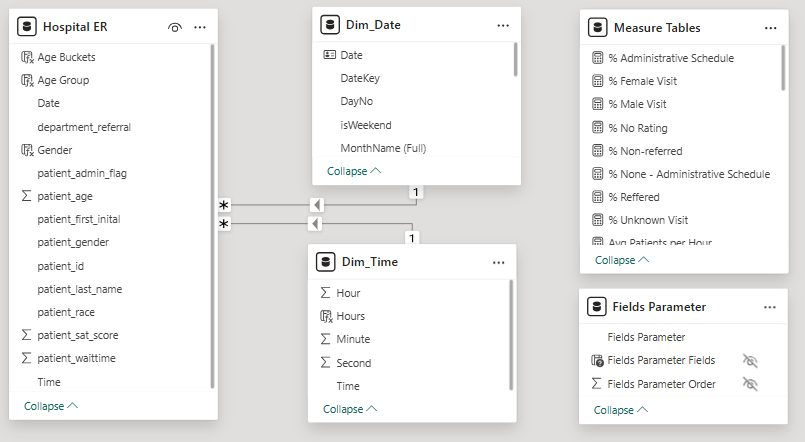
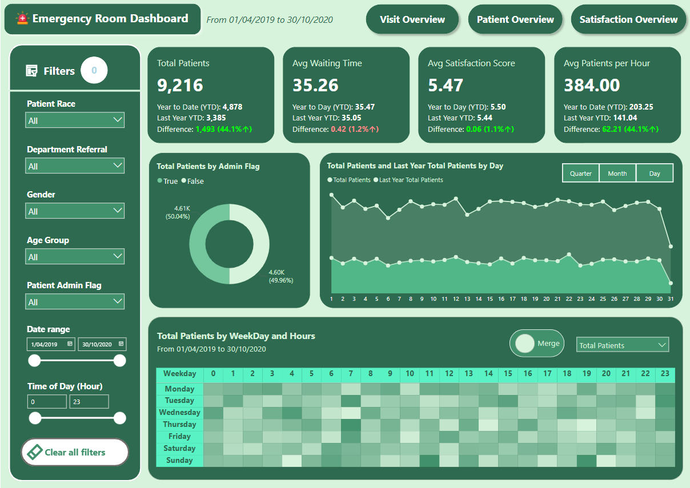
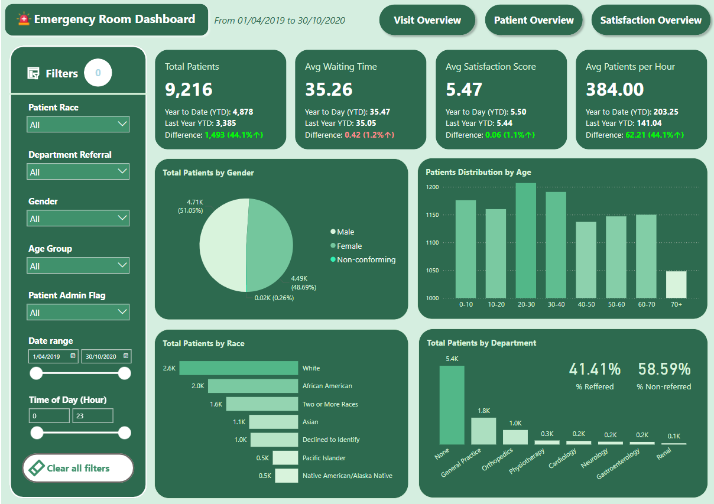
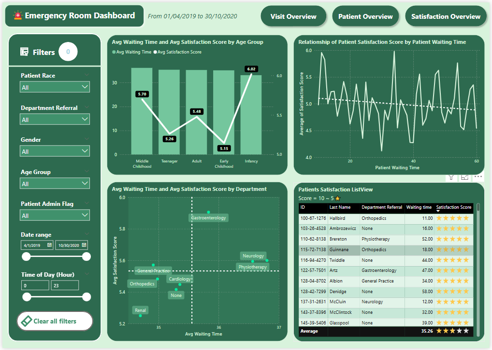

# 🏥 Hospital Emergency Room Analysis - Power BI Dashboard
## 📌 Project Overview
This Power BI project analyzes emergency room (ER) data to provide actionable insights into patients' visits, waiting time, and satisfaction. The dashboard helps hospital administrators and medical staff monitor ER performance, optimize resource allocation, and improve patient care by identifying trends in admissions, and peak visit periods.

## ❓ Problem Statement
The hospital's emergency room (ER) is experiencing challenges in patient admission management and operational efficiency. Key areas of concern include:
- Patient Visit Trends – Understanding daily, weekly, and seasonal fluctuations in ER visits.
- Wait Time Management – Analyzing the time patients spend before receiving treatment and its impact on patient satisfaction.
- Demographic Insights – Evaluating patient distribution by age, gender, and race to ensure equitable healthcare access.
- Department Referrals – Understanding which departments receive the most ER patients and the relationship with waiting time and satisfactions.
- Peak Hours & Resource Allocation – Identifying high-traffic periods to optimize staff scheduling and medical resource allocation.

The goal is to analyze these factors using a Power BI dashboard to improve ER efficiency, reduce waiting times, enhance resource planning, and ultimately provide better patient care. 🚑📊

## 🛠️ Skills Demonstrated
-	**Power BI** for data visualization, modeling, and analysis.
## 📊 Dataset Information
- Source: Excel file containing sales data.
- Key Columns:
    - Date
    - patient_gender
    - patient_age
    - patient_sat_score
    - patient_race
    - patient_admin_flag
    - patient_waittime
    - department_referral

## 🔄 Data Transformation
To optimize performance and structure, **Power Query** was used to transform the raw dataset into a **star schema model**. The original dataset was broken down into:
-	**Fact Table**:
    -	Fact_Sales: ...   
-	After applying transformations in Power Query and loading the data into **Power BI Desktop**, two additional dimension tables were added to support **time intelligence calculations**:
    -	Dim_Date: Contains Date, DateKey, DayNo, and isWeekend fields for date-based analysis.
    -	Dim_Time: Includes Hour, Minute, Second, and Time fields to enable time-based insights.
    -	
## 📐 Data Modeling
Below is the **star schema model** and support tables used in this project:
 
 
## 📈 Analysis & Visualizations
 
 
 
 
  
  
The Power BI dashboard consists of various visual elements to display insights:
...

## 📌 Conclusion & Recommendations
...

## 🚀 How to Use This Dashboard
1.	Download the .pbix file from the repository.
2.	Open Power BI Desktop and load the file.
3.	Use filters and slicers to explore insights interactively.
___
🔗 For further improvements, feel free to fork this project and contribute! 🚀
